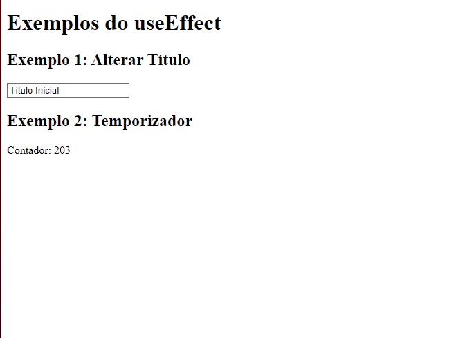

# Documentação - Exemplos do useEffect

Essa documentação explica de forma simples os dois exemplos que criei usando o `useEffect` no React. 

----------

## Exemplo 1: Alterar o Título da Aba do Navegador

### O que faz?

Quando você digita algo no campo de texto, o título da aba do navegador muda automaticamente para o que foi escrito.

### Como funciona?

1.  Tem um estado (`title`) que guarda o texto que você digitou.
2.  O `useEffect` percebe quando o texto muda e altera o título da aba (`document.title`).

### Código:

```javascript
function ChangeTitle() {
    const [title, setTitle] = useState("Título Inicial");

    useEffect(() => {
        document.title = title; // Atualiza o título da aba
    }, [title]);

    return (
        <div>
            <h2>Exemplo 1: Alterar Título</h2>
            <input
                type="text"
                value={title}
                onChange={(e) => setTitle(e.target.value)}
                placeholder="Digite o novo título"
            />
        </div>
    );
}


```
## Exemplo 2: Temporizador

### O que faz?

É um contador que aumenta sozinho, de 1 em 1, a cada segundo. Não precisa fazer nada, só olhar o número subindo. 

### Como funciona?

1.  Criei um estado (`count`) que começa no zero.
2.  O `useEffect` cria um intervalo (`setInterval`) que aumenta o contador a cada segundo.
3.  Quando o componente sai da tela, o intervalo é limpo para não causar problemas.

### Código:

```javascript
function Timer() {
    const [count, setCount] = useState(0);

    useEffect(() => {
        const interval = setInterval(() => {
            setCount((prev) => prev + 1);
        }, 1000);

        return () => clearInterval(interval); // Limpa o intervalo
    }, []);

    return (
        <div>
            <h2>Exemplo 2: Temporizador</h2>
            <p>Contador: {count}</p>
        </div>
    );
}` 
```
## Resumindo

-   **useEffect** serve pra lidar com coisas que acontecem "por fora", tipo atualizar o título da aba ou mexer com intervalos.
-   Fiz dois exemplos bem simples pra mostrar como usar isso na prática:
    1.  Um altera o título da aba.
    2.  Outro faz um contador.

## Print do site: 

